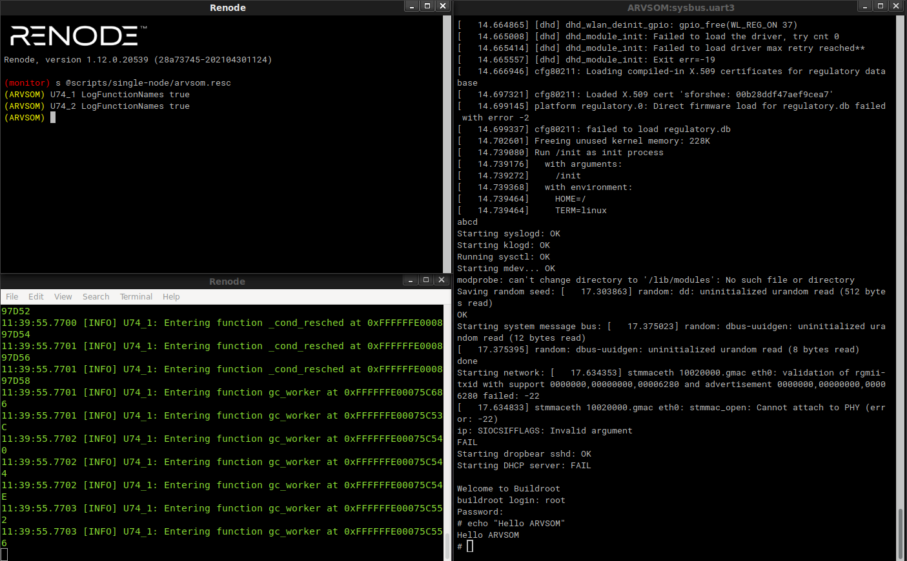

*This post was originally published at [Antmicro](https://antmicro.com/blog/2021/04/arv-som-announcement/).*

We are excited to announce the ARVSOM – Antmicro’s [fully open source](https://github.com/antmicro/arvsom), RISC-V-based system-on-module featuring the StarFive 71×0 SoC. Using the RISC-V architecture, which Antmicro has been heavily involved in since the early days as a Founding Member of RISC-V International, the SoM is going to enable unprecedented openness, reusability and functionality across different verticals.

We are excited to announce the ARVSOM – Antmicro’s [fully open source](https://github.com/antmicro/arvsom), RISC-V-based system-on-module featuring the StarFive 71×0 SoC. Using the RISC-V architecture, which Antmicro has been heavily involved in since the early days as a Founding Member of RISC-V International, the SoM is going to enable unprecedented openness, reusability and functionality across different verticals.

## Open source-driven innovation

Since its conception, Antmicro has been enabling its customers to tap into the technological freedom that is inherent in open source. We’ve been developing cutting-edge industrial and edge AI systems using vendor-neutral and customizable solutions as well as actively developing and contributing to the tooling ecosystem, improving processes and unlocking even more system design options – often in alignment with our efforts driving [RISC-V International](https://riscv.org/members/) and [CHIPS Alliance](https://chipsalliance.org/about/members/). Targeted at a range of different use cases and enabling unmatched flexibility, ARVSOM is the latest product and example of Antmicro’s expertise in creating practical and easily modifiable technologies using open source.

## Based on StarFive 71×0

Sitting at the heart of ARVSOM is the [StarFive](https://starfivetech.com/en) 71×0 system-on-chip – the first Linux-capable RISC-V SoC that is intended for mainstream, general-purpose edge applications and is expected to be used in millions of devices to be built on the open source RISC-V ISA. The SoC is also used in the [BeagleV StarLight](https://github.com/beagleboard/beaglev-starlight) development platform ([GitHub repo](https://github.com/beagleboard/beaglev-starlight)) which has just been shipped to beta users, including Antmicro, who will be verifying its robustness and reliability in real life use cases, while the development community focuses on further expanding the RISC-V software support. The SoC features a dual core U74 CPU from our partner and RISC-V pioneer [SiFive](https://sifive.com/), two AI accelerators: the open source NVDLA and SiFive’s Neural Network Engine, 1 MIPI DSI and 2 MIPI CSI interfaces, HDMI, Gigabit Ethernet, dual ISP, USB 3.0, while the production version of the SoC to be released later in the year will also have PCI Express.

## Compatible with Scalenode for server room applications

The SoM will be compatible with our server-oriented [Scalenode platform](https://antmicro.com/blog/2021/04/scalenode-server-oriented-raspberry-pi4-baseboard/), released earlier this month, originally designed as a baseboard for the Raspberry Pi 4 Compute Module. Used together, Scalenode and ARVSOM will enable building easily scalable and flexible infrastructures consisting of clusters of small RISC-V-based compute units, with as many as 18 Scalenode boards fitting in a 1U rack. ARVSOM will also work with other Raspberry Pi CM 4 baseboards, opening the door to a host of solutions and custom devices to be built with it right away.

You can already start software development with our ARVSOM and the BeagleV StarLight SBC thanks to support in [Renode](https://renode.io/), our open source simulation framework. The two have joined an array of platforms and sensors that can be simulated in our open source framework for system development and testing. You can freely co-develop hardware and software in Renode’s virtual environment, with the code behaving exactly the way it would on real hardware. Renode can also be used throughout the development lifecycle to enable continuous testing and integration, as well as prototyping new solutions based on RISC-V, as it features extensive support of this open source ISA. You can read more about the latest updates in Renode in the [version 1.12 announcement blog note](https://www.antmicro.com/blog/2021/04/renode-1-12-release/).

Our SoM is in development and will be gradually unveiled throughout the year with the increasing StarFive 71×0 SoC availability.

ARVSOM can be customized and integrated into your project. We have been helping our customers embrace the groundbreaking RISC-V architecture and enable them to reap the benefits of having an advanced system based on vendor-neutral, future-proof and robust technologies. Get in touch with us at contact@antmicro.com if you need a modern product that you have full control over.