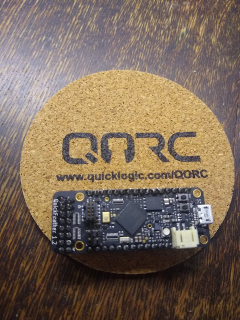
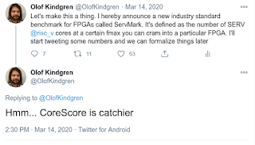
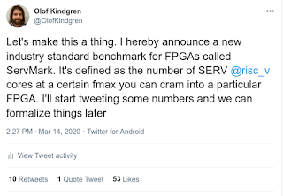
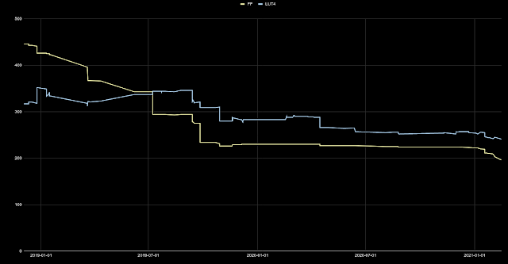

*This post was originally published by [Olof Kindgren](https://olofkindgren.blogspot.com/2021/02/fossi-fever-2020.html)*

## FOSSi Fever 2020

2020 was a year with a lot of bad news and so it feels slightly strange to cheerfully write about a very specific topic in the light of this. But there will always be good and bad things happening in the world. So let’s keep fighting the bad things and for now take look at what happened last year within the amazing world of open source silicon. I will start by mentioning the most significant, but by no means the only, milestones for the FOSSi movement as a whole and then take a more personal look at the work where I have been directly involved.

## OpenMPW

The biggest story within free and open source silicon this year has undoubtly been the [openMPW project](https://efabless.com/open_shuttle_program) involving Google, SkyWater Foundries and eFabless together with a number of other collaborators.

Ever since I got involved in open source silicon ten years ago, building a fully open source ASIC has been one of those big milestones. While we have had FOSSi IP cores taped out on chips for at least 20 years and parts of the flow being managed by open source tools, it has always seemed to be too much work and requiring filling in too many gaps to have a fully open source end-to-end flow to produce ASICs. But, over the years people all over the world have filled in the gaps and done the work bit by bit. Sometimes in the context of overarching programmes to advance open source silicon, sometimes in academic settings, sometimes coming from the industry and sometimes as completely unpaid hobby projects. And this year all these efforts came together, helped by funding, to produce four shuttle runs, each loaded with 40 different completely open source designs. The first of these runs are currently being fabricated, and it will be extremely interesting to see them coming back.

One of the final pieces in this puzzle was the PDK. And while SkyWater should be rightfully lauded for their decicion to open up their 130nm PDK, it begs to ask the question: Why on Earth did it take this long? What could possibly the fabs have to lose by doing this? What they gain is easy to answer, a completely new market of users who can create chips at their fab. According to people within the project, it’s estimated that 75% of the people on the first shuttle define themselves as software engineers. It’s very likely that none of these people would ever dream of making an ASIC without this possibility. So I kind of feel that making the EDA industry open up their formats is a bit like trying to get your kids to eat vegetables. It’s a lot of groaning and complaining, but was it really all that bad in the end to get some nutritions. Or in the case of ASIC fabs, was it really all that horrible to release your PDK to get some more customers? Let’s just hope this opens up the eyes of more fabs. My, and many others, dream is to eventually see the same thing happening to ASIC fabs as has been happening with cheap PCB services over the past ten years. And using that analogy, I’m quite sure it pays off to be early in the race. So, get started folks!

## QuickLogic and SymbiFlow

The other big thing happening this year is that we finally have an FPGA-vendor shipping an open source toolchain for their devices. The company that will go down in the annals of history for being the first to do this is [QuickLogic](https://www.quicklogic.com/qorc/) and their EOS S3 FPGA. This is by no means the first FPGA with an open toolchain, and the QuickLogic-flavored version of [SymbiFlow](https://symbiflow.github.io/) developed by FOSSi veterans [Antmicro](https://antmicro.com/) is based on all this prior work. But it is the first time we see a toolchain being created from the FPGA manufacturer’s specifications rather than being figured out from compiled FPGA binaries and it’s the first toolchain that is supported and funded by the vendor rather than being at best tolerated by them. And again I must ask, why did it take so long for this to happen? If I was running a small FPGA startup with limited resources, I can’t for my life understand why I would want to spend a lot of time and money to build and continouosly maintain a big unwieldy toolchain all by myself instead of adding the required device-specific bits to a known good open source toolchain and share the maintenance burden. If nothing else it would free up resources to build other value-add products on top of the tools. It’s like if every vendor of computer systems would first build their own operating system and compiler before shipping their products. This is what we had in the 80s and abandonded it for very good reasons. Because it made absolutely no one happy. And you know what? I think the users of FPGAs should put more effort into pushing their vendors to support open source toolchains, because it will save everyone a heap of time and money.

Let me illustrate that last point with an example that actually happened when I was porting SERV to the QuickLogic devices. After synthesis I noticed that it used far more resources than expected. Looking at the synthesis logs I realized the memories in the design weren’t mapped to on-chip SRAM. So I asked the toolchain developers about this. They pointed me to the file in the toolchain that contained the rules for mapping to SRAM. I quickly found a badly tuned parameter, changed it to a more sensible value and ten minutes later it was working fine. An hour later I had submitted a patch back to the toolchain that fixed the problem for everyone else who would encounter it.

let’s break this down into numbers. Finding the cause of the bug took about 15 minutes. Fixing it, another five. At that point I could use it myself, but after spending another 15 minutes or so, it was also fixed for everyone else.

Now let’s do the same exercise for a proprietary closed source toolchain. Finding the cause of the bug takes… well…it depends… Let me explain.

I started my professional career at a company which at that point was the world’s largest FPGA buyer. Whenever we had problems, they flew in two FAEs to sit in our lap, they could provide us with custom internal builds of their tools and generally tried to make sure the problem quickly went away so that we would continue to buy FPGAs from them. However, most companies are not the world’s largest FPGA buyer and does not get this treatment. Instead you will have to wade through layers of support people until you reach someone who is actually qualified enough to acknowledge the issue. I have been in this situation numerous times and would estimate this process usually takes around 2-3 months. Actually fixing the bug probably takes five minutes or so in this case too, but here comes the fun part. In most cases you will now have to wait, I don’t know, a year or so until the fixed bug ends up in a released product that you can download. What happens in practice is that the user tends to find a workaround instead. In the example above, the likely solution would be to instantiate a RAM macro instead of relying on inference. This however doesn’t come for free as it requires finding all the instances where this is a problem, add special handling for this case which results in a larger code base with more options to verify and maintain. This costs time and this costs money. So the moral of this story is that closed source tools are more expensive for everyone involved and users of FPGAs should get better at telling the FPGA vendors that they are done with this closed source nonsense.

*The QuickFeather. First FPGA board to ship with a FOSSi toolchain*

There are numerous other news and projects that are well worth mentioning, but the above two are milestones that we have been waiting for a long time, so they deserved special attention. And if you want to keep up with the latest happenings in open source silicon, I highly recommend subscribing to the [El Correo Libre newsletter](https://www.fossi-foundation.org/ecl) which does a fantastic job of providing an overview of what goes on in all corners of the world. So let’s move on to some of my more personal victories that aren’t necessarily mentioned in other people’s year in review.

When I am working on and talking about open source silicon I am often wearing many hats because I’m associated with several different organizations. Luckily they are all pretty much aligned on this topic which makes things far easier. But these organizations also have different motives and goals so I would like to mention a few words about them here.

## Qamcom

My dayjob is working for [Qamcom Research & Technology](https://www.qamcom.com/) and also there it has been more FOSSi work than usual, which I think is a good indication that open source silicon is becoming increasingly more common in chip design in general. The year started off by finishing up some work on [SweRVolf](https://github.com/chipsalliance/Cores-SweRVolf) together with a couple of my Qamcom colleagues. SweRVolf is a project under [CHIPS Alliance](https://chipsalliance.org/), an organization that Qamcom has been part of since 2019 to help improve the state for open source and custom silicon. After that I was pulled into a project for doing [climate research with a huge radar system](https://www.qamcom.com/eiscat-climate-research/). My task here was to handle sub-nanosecond time synchronization between systems located hundreds of miles from each other, using the [White Rabbit](https://ohwr.org/project/white-rabbit/wikis/home) system developed at CERN. I was pretty excited about getting to know White Rabbit. The timing section at CERN responsible for the White Rabbit project and associated technologies are household names within open source silicon and have a long history here. I know many of the people working there personally and have great respect for their work. But so far I  haven’t had the chance until now to actually get down and dirty with the technology. Once my job was done there I moved on to another proprietary project that I can’t discuss here. I do get to use FuseSoC and Verilator though, so it’s fine 🙂

## FOSSi Foundation

The hat I tend to wear most when topic revolves around open source silicon is my FOSSi Foundation director hat. And despite doing a lot less of the things we normally spend time on, it turns out we did a lot of other great things instead. I will however not go into more detail here, but instead point to the [excellent summary](https://www.fossi-foundation.org/2020/12/31/year-recap) done by my FOSSi Foundation colleague Philipp Wagner.

## RISC-V

Arguably the most well-known project nowadays with ties to open source silicon is RISC-V. My RISC-V ties deepened in the beginning of the year when I was asked to become a [RISC-V ambassador](https://riscv.org/community/ambassadors/). Part of being an ambassador is to create awareness of RISC-V in the fields where I’m active. For well-known reasons the number and nature of events were a bit different from previous years which meant fewer opportunities to weild this new-found power, but I did participate in an ask-the-expert session during the RISC-V global forum and a couple of other events that will be described later. And I also got to be interviewed about RISC-V and open source silicon by Sweden’s largest [electronics](https://etn.se/index.php/intervju/67308-olofs-oppna-hardvara-forokar-sig.html) and [tech news](https://www.nyteknik.se/premium/risc-v-oppet-kisel-standard-i-processorer-inom-tio-ar-7002031) outlets as well as the [Architecnologia blog](https://architecnologia.es/olof-kindgren-interview).

*Current crop of RISC-V Ambassadors; AKA the Twantasic 12*

In addition to my day job and participating in different organizations I also run a bunch of open source projects, so let’s take a look at the progress of the most important ones during 2020.

## SweRVolf

[SweRVolf](https://github.com/chipsalliance/Cores-SweRVolf) is an extendable and portable reference SoC platform for the Western Digital / CHIPS Alliance [SweRV cores](https://www.westerndigital.com/company/innovations/risc-v). SweRVolf is designed for software engineers who wants a turn-key system to evaluate SweRV performance and features, for system designers who want a base platform to build upon and for learners of SoC design, computer architecture, embedded systems or open source silicon methodology. To easily achieve the goals of portability and extendability it is powered by [FuseSoC](https://github.com/olofk/fusesoc), which just happens to be one of my other open source silicon projects mentioned later on.

During 2020 SweRVolf gained support for booting from SPI Flash but most effort was spent on usability,  by making it rock-solid, improve documentation, increase compatibility with more EDA tools, keep the underlying cores up-to-date and follow along with changes in the [Zephyr operating system](https://zephyrproject.org/), which is the officially supported software platform for SweRVolf.

But the biggest thing to happen SweRVolf this year is that SweRVolf will be used as the base of a new university course from Imagination University Programme called [RVfpga: Understanding Computer Architecture](https://university.imgtec.com/teaching-download/#CA). I’m very excited (and slightly scared) about soon having thousands of students getting familiar with computer architecture, RISC-V and open source silicon through a SoC that I have designed. And I would like to mention a few things about how SwerRVolf is built because I think it’s a great example of how to create chip designs. When I say that I have designed SweRVolf, most of the work has consisted of putting together various pieces and make sure it works well as a whole. Most of the underlying code has been written by other people, and from my perspective, that is really the most successful aspect of SweRVolf because it highlights the rich open source silicon ecosystem. The main CPU core is from Western Digital and governed by CHIPS Alliance. Most of the AXI infrastructure was developed through the [PULP project](PULP project) at ETH Zürich and University of Bologna. The UART and SPI controllers were developed for the [OpenRISC project](https://openrisc.io/) during the first wave of open source silicon almost 20 years ago. The [Wishbone infrastructure](https://github.com/olofk/wb_intercon/) was developed by me when I started out with open source silicon ten years ago and the memory controller was created by [Enjoy Digital](http://www.enjoy-digital.fr/) and is written in Migen as part of the [Litex](https://github.com/litex-hub) ecosystem. And to go full circle, the memory controller uses a tiny RISC-V CPU called SERV internally to aid with calibration. [SERV](https://github.com/olofk/serv), the world’s smallest RISC-V CPU is written by me. Small world. And of course the whole project is packaged with [FuseSoC](https://github.com/olofk/fusesoc) and uses [Verilator](https://www.veripool.org/wiki/verilator) by default for simulations, so it’s FOSSi all the way. As I hope you understand by now it’s not about some lone hero churning out code, but instead all this has been made possible by a huge amount of work by a ton of people over many years, and I’m proud to be one of them.

## SERV

Probably the hobby (read unpaid) project I spent most time on during 2020 was [SERV](https://github.com/olofk/serv), the world’s smallest RISC-V CPU, which turned from small to even smaller during the year. SERV is very much a project driven by numbers, so lets look at some of these numbers.

In February I got hold of an [ZCU106](https://www.xilinx.com/products/boards-and-kits/zcu106.html) development board with a huge Xilinx Ultrascale+ FPGA for a project I was assigned to. As this was the largest FPGA I had ever had in my home I got curious to see how many SERV cores I could squeeze into it. The year before, at the 2019 RISC-V workshop in Zürich, I had done a [presentation on how to fit 8 RISC-V cores in a small Lattice iCE40 FPGA](https://www.youtube.com/watch?v=xjIxORBRaeQ) (spoiler: it ended up being slightly more than 8 eventually), giving each of them a single I/O to communicate with the outside world. Problem this time was that after stuffing in 360 cores I run out of I/O pins. It would also had been practically impossible to verify that all these external pins actually did what they were supposed to do, so I needed some way of using less than one I/O pin per core. Then it struck me that just a few months earlier I had created a heterogenous sensor aggregation platform based on SERV cores called [Observer](https://github.com/olofk/observer). The idea with Observer was to connect a lot of sensors to an FPGA, each serviced by its own SERV core and then merge the data to an output stream. I gave up on the platform when I realized that while I could fit a lot of SERV cores into the devices, I just had a few sensors so there wasn’t much data to to aggregate. But this platform was a very good starting point.

*Block diagram of the Observer platform*

By removing all sensor interfaces and just have each core print out an identification message instead I had a system that I could instantiate with any number of cores. Trying this on the ZCU106 I could now run over 600 cores on the FPGA. The next problem then was that I was running out of on-chip RAM way before any of the other FPGA resources. In case you don’t know, most FPGAs contain a number of fixed-size SRAM spread out over the devices, each typically being 1-8kB large. For SERV, each core used one for the RF (register file), and another one for the program/data memory. With RISC-V using 32 32-bit registers, this means that only 128 bytes of the RF RAM is used but since the fixed-size SRAM on FPGAs are typically being far larger than that most of the RAM ends up unused. That’s bad, but I had a plan. With a bit of work I managed to share RF, program and data in the same RAM so that the RF is allocated to the top 128 bytes of the RAM. This freed up half of the on-chip RAM blocks and I could eventually hit 1000 SERV cores on the ZCU106 board. Of course, at this point I was curious to see what the situation was for other boards after all these optimizations. Taking it one step further I figured I should turn this into a real thing by creating a benchmark so that people can have a quick way to see roughly how large the FPGAs are on different boards. And with that ServMark was born.

ServMark lasted for about three minutes until I realized [CoreScore](https://github.com/olofk/corescore) was a much catchier name, so that’s we have now.

I had originally planned to do a presentation about SERV at Latch-Up in Boston. But for well-known reasons we cancelled all FOSSi Foundation physical events. Instead I accepted an invitation to speak at the [First virtual RISC-V Munich meetup](https://www.youtube.com/watch?v=_huTcpAc7sQ). By this point I had attended a couple of virtual meetups and I hated it. It was in most cases awful to watch a narrated slide deck without a stage and a speaker to bring it to life at least a bit. So, I decided to take a fresh look and look at the possibilities instead of being limited by the medium. I decided to make videos instead. First of all, since people would watch on a computer screen with proper resolution instead of a washed-out image projected on canvas. This meant I could have much more detailed pictures and smaller font sizes. I could also freely mix pictures and animations, fine-tune timings, do several takes of the audio and add sound effects. And despite being done by someone who has pretty much zero experience in these sort of things, I think it turned out pretty well. So on the day of the event, I just introduced myself and let the audience indulge in my [fully immersive multimedia edutainment experience about SERV](https://diode.zone/videos/watch/0230a518-e207-4cf6-b5e2-69cc09411013). Not sure why the Oscars committee hasn’t got in touch yet.

Is CoreScore the only attempt to put a mind-boggling number of RISC-V cores inside chips? Absolutely not, and during the summer I learned of the Manticore project from Florian Zaruba and Fabian Schuiki (jointly known as Flobian Schuba) from ETH Zürich, both well-known names in the FOSSisphere from their work in the PULP ecosystem. [Manticore: A 4096-core RISC-V Chiplet Architecture for Ultra-efficient Floating-point Computing](https://arxiv.org/abs/2008.06502) had been accepted into the prestigious Hot chips conference. Manticore is an impressive project, but I still thought it was a bit unfair that I wasn’t invited as well. So I reached out for the biggest FPGA board I could find and then wrote my first academic paper of the year called [Plenticore: A 4097-core RISC-V SoClet Architecture for Ultra-inefficient Floating-point Computing](https://github.com/olofk/serv/blob/doc/plenticore.pdf). Unfortunately I did not recieve an invitation to Hot chips despite this. I assume it must have gotten lost in the mail somewhere.

Oh well, let’s look at some more numbers instead.

- A number of optimizations was found over the year which, depending on the measure, further shrank the core 5-10%.
- The number of supported FPGA boards for the [servant SoC](https://github.com/olofk/serv/blob/master/servant.core) grew from 4 to 17, mostly thanks to other contributors (thanks everyone, love you all!)
- The SERV support for the Zephyr operating system was rewritten and upgraded from the aging Zephyr 1.13 to 2.4, the latest version at the time of writing.

*SERV resource usage over time on a Lattice iCE40 FPGA*

Coming back to CoreScore, the results right now range from 10 cores on a smaller Lattice iCE40 device up to [5087 cores](https://twitter.com/OlofKindgren/status/1265170129911980032) on a large Xilinx device and the high score table can even be [viewed interactively online](https://corescore.store/! If you can’t find your favorite board there, just send a PR and we’ll get it added. And if any people with access to crazy large FPGAs happen to read this, please get in touch with me. I’m very curious to see who will be first to get above 10000 cores.

SERV also saw another great improvement in the form of [documentation](https://serv.readthedocs.io/en/latest/). While not completely there yet, the functionality of most SERV modules have been documented together with detailed schematics showing the implementation down the individual gates, muxes and flip-flops. And most changes to the source are now accompanied by a code comment to clarify what is going on. Since SERV is optimized for size rather than readability, many parts of the core are difficult to figure out by just looking at the source code. Hopefully this will make it easier for other who want to understand or work on the core, but frankly it has also been very useful for me since I tend to forget why I did things in a certain way so I have had to spend a lot of time following my own tracks.

*Schematic of the SERV control unit from the SERV documentation*

## FuseSoC

The oldest of my open source silicon project still going strong is [FuseSoC](https://github.com/olofk/fusesoc). It is now about to turn ten years old and keeps growing in features and users for each year. Looking back at the changes through 2020 I can see some new trends in the development. The most important one is that for the first year ever, most of the work was not done by me. During 2020, my fellow FOSSi Foundation director and LowRISC employee Philipp Wagner has been pulling the heaviest load of FuseSoC development. And with Philipp came quality. Dr. Wagner has improved FuseSoC in pretty much every aspect. Bugs have been fixed and features has been added. The development experience has been improved by CI testing, automatic code formatting checks and improved testing coverage. And what makes me happiest is that the user experience has been improved not least by a total [rewrite of the documentation](http://fusesoc.readthedocs.io/) into something that is actually useful and can be proudly shown to the world. All this is very much needed as FuseSoC is becoming increasingly popular. It has already been picked up by many of the flagship open source silicon projects like [OpenTitan](https://opentitan.org/), [SweRVolf](https://github.com/chipsalliance/Cores-SweRVolf), [OpenPiton](https://parallel.princeton.edu/openpiton/) and with the [RVFPGA](https://university.imgtec.com/rvfpga/) university programme there will soon be a whole new generation who will get familiar with it as well.

## Edalize

In 2018, the part of FuseSoC that interacted with the EDA tools was spun off into [Edalize](https://github.com/olofk/edalize). The reason was that it was believed this part could be useful for others who weren’t interested in the whole FuseSoC package. This prediction seems to have been correct and Edalize has very much started a life on its own by now. In addition to FuseSoC, Edalize is now used by several other projects such as [Silice](https://github.com/sylefeb/Silice), [Clash](https://clash-lang.org/) and [fpga-perf-tool](https://github.com/SymbiFlow/fpga-tool-perf) and over the year Edalize has gained support for 7 new EDA tool flows, bringing the total number up to 25.

2020 was also the year when Edalize had it’s first taste of being in the spotlight on its own merits. For the [Workshop on Open-Source EDA Technology (WOSET) 2020](https://woset-workshop.github.io/) I decided to submit a presentation about Edalize. Being an academic conference this also prompted me to write an accompanying paper as is the common courtesy for these kind of events. [The paper](https://woset-workshop.github.io/PDFs/2020/a20.pdf) received a lukewarm response but was accepted anyway. Once again I did not feel like reciting slides to a camera so I turned back to my new-found interest in advanced multimedia productions. And it paid off. [The Edalize video](https://www.youtube.com/watch?v=HuRtkpZqB34) won an award for [best video at WOSET 2020](https://woset-workshop.github.io/WOSET2020.html#best-video). Well done Edalize!

## LED to Believe

All of the above projects use FuseSoC and Edalize because – well it’s kind of why I created FuseSoC in the first place – to easily reuse components and retarget to different devices. But I also realized there was a need for a dead simple project to help people getting started with FuseSoC – the Hello world of silicon, so to speak. And the Hello World of silicon is of course the blinking LED. So in 2018 I created project LED to Believe with the ambitious goal to create FuseSoC-powered LED blinkers for every FPGA board ever made. The project has several aspects that are useful in different ways. It serves as a very simple introduction to FuseSoC and how to make a design that targets multiple hardware. It is also an excellent pipe cleaner for when you receive a new board. If you can run the project successfully and get the LED to blink, it likely means you have managed to install all the EDA tools correctly which is no small feat, and you also have a template to take on bigger projects. And it’s also fun to see what boards are available out there. While I have submitted a bunch of the board ports myself, the vast majority have come from all the fantastic contributors out there. And during 2020 the number of supported boards grew from 16 to 44. Perhaps not all the FPGA boards ever made, but a considerable chunk of them. And already in the short amount of 2021 that has passed, there have been numerous more contributions so we’re getting closer all the time.

In closing, 2020 was a busy year FOSSi-wise. And this has just touched upon the surface of all things that have been happening during the year. And just as we were about to close the books on 2020, I was informed that Lattice had incorporated one of my FOSSi projects into their shiny new award-winning Propel design suite. Which project, you might ask? Was it the similarly award-winning FuseSoC, to give Lattice users immediate access to a rich ecosystem of Open IP cores? Or was it the Rosetta stone of Edalize, with its award-winning video, that would easily provide a coherent interface for a dozen simulators and make it easy to switch between Lattice’s multitude of FPGA tools such as Diamond, icecube2 and Radiant? Or was it SERV itself, the award-winning CPU capable of offering a RISC-V experience for all but their absolutely smallest offerings? Well, actually, none of the above. It turns out that Propel now contains ipyxact, my somewhat feature-limited Python library for working with IP-XACT files. Not my first choice, but fair enough. I wonder if they have read [my somewhat complicated relationship with IP-XACT](https://olofkindgren.blogspot.com/2016/11/ip-xact-good-bad-and-outright-madness.html).

*Finally my work is recognized by big EDA vendors (picture by Gatecat)*