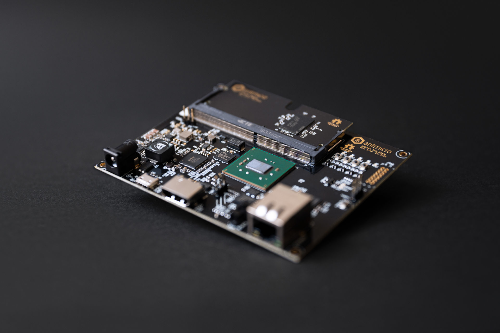

*This post was originally published at [Antmicro](https://antmicro.com/blog/2021/04/lpddr4-test-platform/).*

The flexibility of FPGAs makes them an excellent choice not only for parallel processing applications but also for research and experimentation in a range of technological areas.

We often provide our customers with flexible R&D platforms that can be easily adapted to changing requirements and new use cases as a result of our practice of using open source hardware, software, FPGA IP and tooling.

As an example of such activity, we have recently been contracted to develop a [hardware test platform](https://github.com/antmicro/lpddr4-test-board) for experimenting with memory controllers and measuring vulnerability of various LPDDR4 memory chips to the [Row hammer](https://en.wikipedia.org/wiki/Row_hammer) attack and similar exploits.

## Modular and cost-optimized

Targeting high-volume customer-facing devices where size, power use and unit cost are a priority, LPDDR4 does not come in the form of modules, while the hardware tools and software frameworks for testing it can be prohibitively expensive.
Despite efforts to mitigate the Row hammer exploit, a number number of memories available on the market remain vulnerable to the problem, which calls for a test platform that would allow experimenting with memory chips and memory controllers to devise new mitigation techniques.

Another issue is that preexisting work mostly relies on proprietary memory controllers which cannot be adapted to specific memory access patterns that trigger Row hammer.

To address this need, we have created a fully open source flow including Enjoy Digital’s open source memory controller [LiteDRAM](https://github.com/enjoy-digital/litedram) for which we implemented [LPDDR4 support](https://github.com/enjoy-digital/litedram/tree/master/litedram/phy/lpddr4), to enable testing LPDDR4 memory chips.

What our customer needed was a flexible platform for developing security measures that would be cost-optimized for high volume production.

To accomplish that we’ve built a modular device that consists of the [main test board](https://github.com/antmicro/lpddr4-test-board) and a series of easily swappable testbeds for different memory types, the [first of which is already available on our GitHub](https://github.com/antmicro/lpddr4-testbed).

What is more, thanks to being open source, the platform enables various research teams to combine efforts and work collaboratively on coming up with new attacks and mitigations, as well as fully reproduce the results of the work.

## Experimenting reliably on a robust platform

The platform is based on Xilinx Kintex-7 FPGA and it features several I/O options: HDMI, which can be used for processing video data and experimenting with streaming and HDMI preview applications featuring RAM, USB for uploading your bitstream or debugging, as well as an SD card slot and GbE.

There is also additional 64MB of on-board HyperRAM that enables safe experimentation with interchangeable RAM chips under extreme conditions.

With Antmicro’s commercial development services the platform can be customized to meet your specific requirements, while the open source character of the solutions we use gives you full control over the product and vendor independence.

We help our customers [build complicated FPGA solutions](https://antmicro.com/blog/2021/02/high-throughput-open-source-pcie-on-xilinx-vu19/), [embrace the dynamically growing open source tooling ecosystem](https://antmicro.com/blog/2020/06/quicklogic-open-reconfigurable-computing-press-release/) [and develop various technologies that allow developers to work more efficiently](https://antmicro.com/blog/2021/03/github-actions-self-hosted-runners/) across the whole FPGA spectrum.