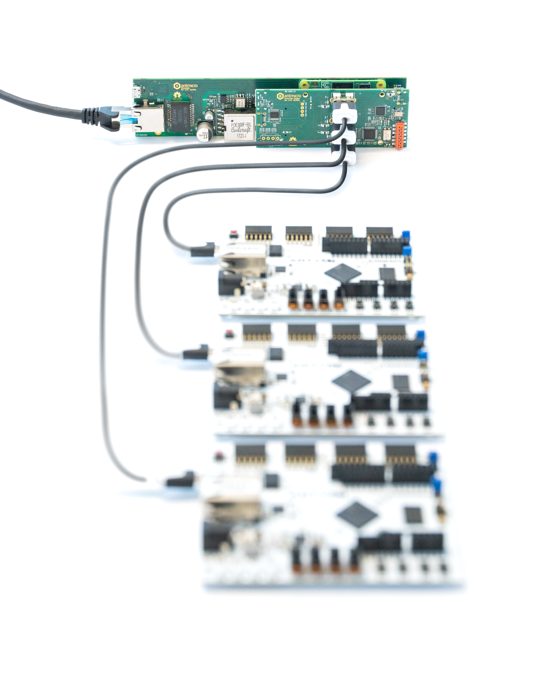
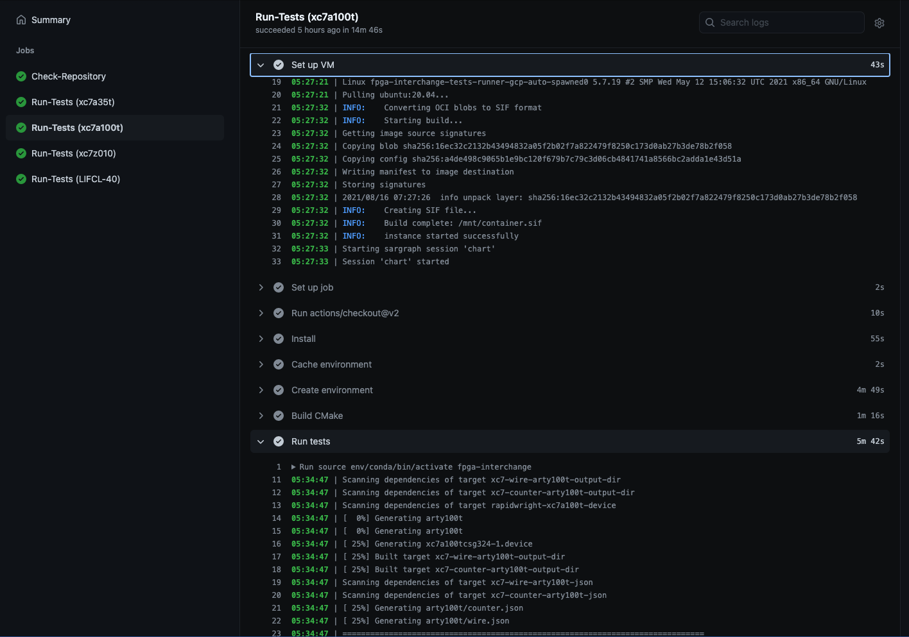
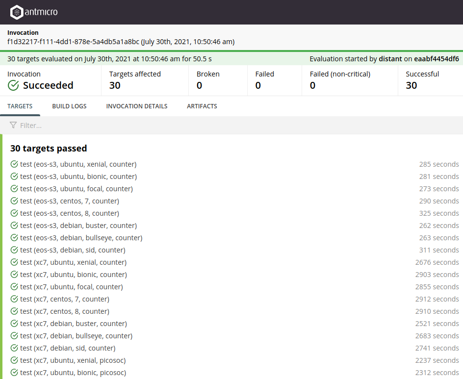

*This post was originally published at [Antmicro](https://antmicro.com/blog/2021/08/open-source-github-actions-runners-with-gcp-and-terraform/).*

In order to fulfill our internal and our customers’ needs, we have developed and successfully deployed an [open source custom GitHub Actions runner](https://github.com/antmicro/runner) that allows us to mix the GitHub default and your custom hardware and software. The runner software itself operates within a Google Cloud Platform project, spawns [Compute Engine instances](https://cloud.google.com/compute/docs/instances) and orchestrates the build, providing a number of interesting advantages that were needed in our ASIC and FPGA-related work. As is typical for us, we have released all the necessary components as open source – read on to learn how the solution works, the benefits it offers and how to build and deploy this software in your organization (which we can also help with as part of our commercial support and engineering services).

As we continue our push for more software-driven hardware development as part of our work within CHIPS Alliance and RISC-V, we see an increasing need for scalable and flexible CI solutions that can be used with a mix of open source and proprietary components. By building on top of existing infrastructure such as GCP, GH Actions and Terraform, it’s possible to achieve noticeable performance gains, better traceability and runtime isolation for some of the advanced use cases we are helping our customers tackle (we have highlighted some of those aspects previously [in a blog note earlier this year](https://antmicro.com/blog/2021/03/github-actions-self-hosted-runners/)).

## Architecture and scalability

By default, the software leverages virtual infrastructure created within a GCP project in order to perform builds, consisting of a coordinator instance (which receives jobs from GitHub backend and reports back progress), a virtual subnetwork and dynamically spawned worker instances.

In order to reduce the cognitive strain and encapsulate complexity, we’ve prepared a [Terraform module](https://github.com/antmicro/github-actions-runner-terraform) that can be used to provision these necessary components easily and make it possible to store the configuration of individual coordinators according to the principles of Infrastructure as Code.

Once provisioned and configured, the coordinator is able to spawn instances of any type available within [Google Compute Engine](https://cloud.google.com/compute/docs/machine-types). In projects where cost optimizations are a necessity, it is possible to configure the coordinator to spawn [preemptible instances](https://cloud.google.com/compute/docs/instances/preemptible).

The setup is flexible enough that you can self-host it in your internal infrastructure and connect custom hardware such as FPGA platforms to the coordinator machine, which will then spawn per-job virtual machines with hardware attached using a pass-through mechanism. This capability makes it possible to build automated hardware in the loop testing platforms – something we see as an increasingly useful feature especially given the growing portfolio of our server-oriented platforms like [Scalenode](https://opensource.antmicro.com/projects/scalenode) and the [FPGA-based DC-SCM](https://opensource.antmicro.com/projects/artix-dc-scm).

## Additional insights into the build capabilities

When creating increasingly complex CI pipelines, we also need a better overview of the builds we are performing. In order to address this requirement, our runner introduces a couple of changes that at the first glance might seem minor, but contribute to a significant improvement in readability.

Firstly, in the build logs, each line of output is prefixed with a green or red-colored timestamp, depending on whether the output is coming from standard output or standard error. As a measure to augment the output of Bash scripts, lines that come out as a result of the “set -x” option are highlighted as well, providing a yet another visual cue for the reader.

Another important improvement is related to performance analysis and resource usage. To get more insight into our complex and often resource-heavy builds (related to the fact that activities such as place and route or physical layout may take many hours if not days to complete), each worker collects a performance graph using [sargraph](https://github.com/antmicro/sargraph) that can be later retrieved using the [upload-artifact action](https://github.com/actions/upload-artifact).

This kind of rich context for our CI infrastructure is a necessity for our work related to e.g. to the [FPGA interchange format](https://github.com/SymbiFlow/fpga-interchange-schema) or [dynamic scheduling in Verilator](https://antmicro.com/blog/2021/05/dynamic-scheduling-in-verilator/) whose goals are to enable radical improvements in FPGA and ASIC design. We are doing this by visiting previously unexplored avenues and encouraging a broad collaboration with the research community, customers and partners to achieve a step function progress in areas which are only now starting to experience the explosion of creativity related to new open source and software-driven approaches.

Apart from supercharging the logs with visual metadata, we’ve addressed the issue of log storage. Google’s BES and ResultStore APIs lend themselves to this use case, allowing the upload of rich metadata associated with the builds and providing a pretty front-end for viewing the logs. Thanks to that, we have an alternative place where logs, artifacts and the aforementioned performance graphs can be stored and viewed independently of GitHub. An example of how this works can be seen in the [SymbiFlow examples repository](https://github.com/SymbiFlow/symbiflow-examples) by clicking on any tick associated with a commit and scrolling down to the bottom. This functionality was implemented using our open source [distant-bes](https://github.com/antmicro/distant-bes) and [distant-rs](https://github.com/antmicro/distant-rs) libraries.

## Cloud-assisted ASIC design

The ongoing effort to enable cloud-assisted ASIC design as well as new development methodologies for FPGAs is bound to accelerate going forward, given the high interest among our customers and groups such as [CHIPS Alliance](https://chipsalliance.org/).

We always look forward to projects with partners who want to make full use of modern (and open) tooling and environments which, with knowledge and experience, we’re confident to modify for better, scalable and vendor-neutral system development.