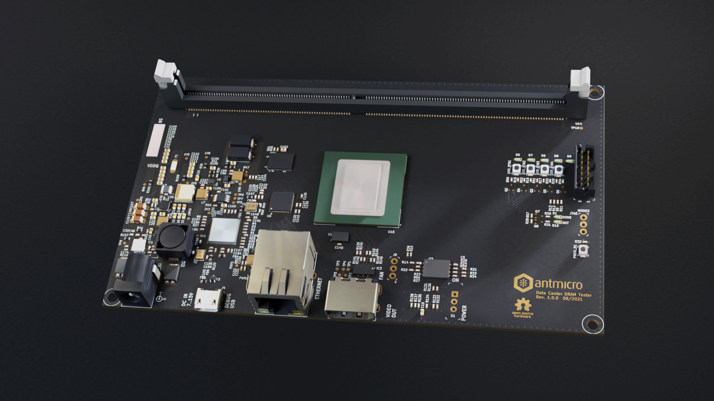
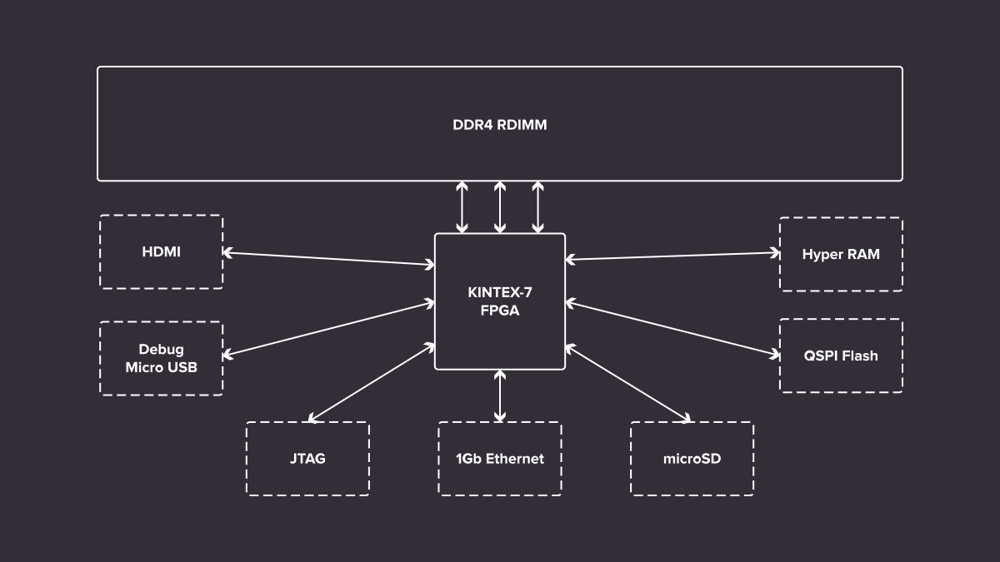

*This post was originally published at [Antmicro](https://antmicro.com/blog/2021/12/open-source-data-center-rowhammer-tester/).*

Our work together with Google and the world’s research community on detecting and mitigating the Rowhammer problem in DRAM memories has been proving that the challenge is far from being solved and a lot of systems are still vulnerable.
[The DDR Rowhammer testing framework](https://opensource.googleblog.com/2021/11/Open%20source%20DDR%20controller%20framework%20for%20mitigating%20Rowhammer.html) that we developed together with an open hardware [LPDDR4 DRAM tester board](https://antmicro.com/blog/2021/04/lpddr4-test-platform/) has been used to detect new attack methods such as [Half-Double](https://security.googleblog.com/2021/05/introducing-half-double-new-hammering.html) and [Blacksmith](https://thehackernews.com/2021/11/new-blacksmith-exploit-bypasses-current.html) and all data seems to suggest this more such methods will be discovered with time.

But consumer-facing devices are not the only ones at risk. With the growing role of shared compute infrastructure in the data center, keeping the cloud secure is critical. That is why we again teamed up with Google to bring the open source FPGA-based Rowhammer security research methodology to DDR4 RDIMM used in servers by designing a new Kintex-7 platform for that use case specifically, to foster collaboration around what seems to be one of the world’s largest security challenges.

## Hardware overview

The [data center DRAM tester](https://opensource.antmicro.com/projects/data-center-dram-tester) is an open source hardware test platform that enables testing and experimenting with various DDR4 RDIMMs (Registered Dual In-Line Memory Module).

The main processing platform on this board is a Xilinx Kintex-7 FPGA which interfaces directly with a regular DDR4 DIMM connector. The new design required more IOs compared to [the LPDDR version](https://opensource.antmicro.com/projects/lpddr4-test-board), which was a major driving factor for changing the Kintex-7 FPGA package from 484 to 686 pins.

Basing the test platform on the Kintex-7 FPGA allowed us to implement a completely open source memory controller – LiteDRAM – fully within the FPGA just like for the LPDDR case. The system can thus be modified and re-configured on both hardware and software level to freely sculpt memory testing scenarios, providing developers with a flexible platform that can be easily adjusted to new data center use cases. Our previous design was targeting a single channel from a single LPDDR4 IC, featuring specially-designed modules to cover for the fact that LPDDR memories aren’t meant to particulary “modular”. For the data center use case however, as reflecting the more standardized nature of that space, the new board can handle a full-fledged, off-the-shelf DDR4 RDIMM with multiple DRAM chips.

As in the LPDDR4 version, the new board features different interfaces to communicate with the FPGA, such as RJ45 Gigabit Ethernet and a Micro USB console. Additionally, there is an HDMI output connector for development purposes. Other features include:

- A JTAG programming connector
- A microSD card slot and 12 MBytes flash memory
- HyperRam – external DRAM memory that can be used as an FPGA cache.

What is worth stressing here is that unlike LPDDR4, DDR4 modules don’t have to be custom made and are available to buy off the shelf – an advantage that greatly expands the potential applicability and outreach of the platform.

## Using open source to transform data centers

The DRAM tester described here is meant, of course, to be used with the Antmicro [open source Rowhammer testing](https://github.com/antmicro/litex-rowhammer-tester) framework mentioned in the opening of this blog note. The list of devices discovered to be vulnerable to attacks so far is significant, and the new design will help to cover a huge chunk of data center oriented memory modules.

The DRAM testing capabilities of the Rowhammer tester are not limited to DDR4 RDIMM memories and [LPDDR4](https://litex-rowhammer-tester.readthedocs.io/en/latest/lpddr4_tb.html) only. Plans for 2022 include support for LPDDR5 and DDR5, which will result in more hardware and collaborations, and hopefully more mitigation techniques. With an open source DRAM controller at the heart, the framework offers potential of collaboration around building Rowhammer mitigations into the controller itself, using the transparency of open source IP to stay one step ahead of the potential attacks.

The recent data center security work is part of our wider effort to push open source tooling, methodologies and approach to data center customers. In a similar vein, within [the LibreBMC group in OpenPOWER Foundation](https://openpower.foundation/groups/librebmc/), we are leading a project to replace ASIC-based BMC (board management controllers) with soft CPUs running on popular and low-cost FPGA platforms. LibreBMC will be a completely transparent security and management solution both in terms of hardware and software and includes [two boards compatible with OCP’s DC-SCM standard](https://opensource.antmicro.com/projects/?search=dc-scm&category=development-platforms&page=1&projectsPerPage=12#filters) based on the Xilinx Artix-7 and Lattice ECP5 FPGAs respectively.

Complementing our software capabilities in scaling huge workloads and building robust [design, development, test and CI, simulation and verification pipelines](https://antmicro.com/blog/2021/08/open-source-github-actions-runners-with-gcp-and-terraform/), our data center oriented platforms also include [Scalenode](https://antmicro.com/blog/2021/04/scalenode-server-oriented-raspberry-pi4-baseboard/), which shows how open source hardware can be used to build modular servers based on both ARM (Raspberry Pi 4 CM) and [RISC-V (ARVSOM)](https://antmicro.com/blog/2021/04/arv-som-announcement/).

Our open source based services ranging from ASIC and hardware design through IP and software development lets us offer comprehensive help to a wide array of data center customers, to improve their security, development speed and collaboration capacities.

## The DDR testing platform in a broader context

The data center DRAM tester is further proof that the open source hardware trend spearheaded by Antmicro can bring practical value, especially in terms of security and collaboration capability. Developing a completely open framework, configurable down to the DRAM controller itself, has led us to some fantastic collaborations and sparked ideas which would otherwise be impossible to implement. Both the CHIPS Alliance, the OpenPOWER Foundation and RISC-V International have a keen interest in taking the memory controller work forward, potentially leading up to ASIC-proven DDR controller IP.

An open source IP ecosystem which we are actively participating in could revolutionize how ASIC and FPGA systems are built. It is one of the key components in a wider push for a more open source, pragmatic and software-centric approach to hardware that we are helping shape at the global level by participating in [policy-making initiatives in the EU and US](https://www.inside-association.eu/post/securing-european-sovereignty-key-recommendations-for-open-source-hardware-and-software).

On a more down-to-earth note, the data center platform is yet another permissively licensed [open source board in our arsenal](https://opensource.antmicro.com/projects?search=&category=development-platforms&page=1&projectsPerPage=12#filters), and can serve as a good reference design for Kintex-7 projects which we are happy to customize and build upon for other areas or types of research for our customers.