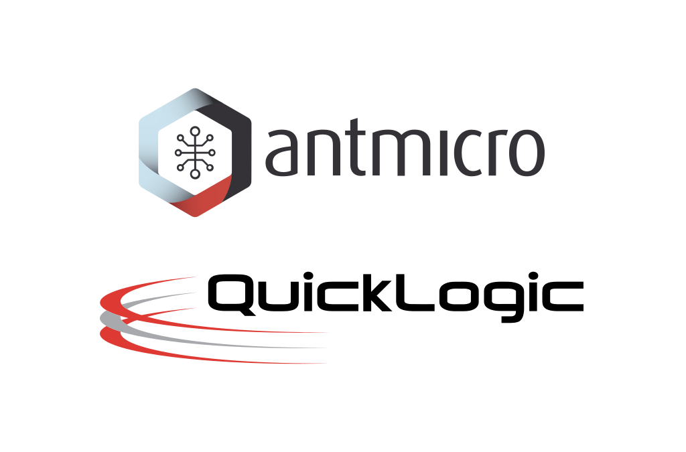

*[Originally issued](https://ir.quicklogic.com/press-releases/detail/535/quicklogic-announces-open-reconfigurable-computing) by QuickLogic, the following press release announces the QORC initiative including the world’s first vendor-supported open FPGA toolchain using SymbiFlow, and describes the contribution of CHIPS Alliance members Antmicro and Google.*

- QuickLogic Open Reconfigurable Computing (QORC) initiative, developed by Antmicro in collaboration with QuickLogic and Google, broadens access to company’s FPGA technology and eFPGA IP for all embedded systems developers
- First Programmable Logic Company to Embrace Open Source FPGA Development Tools

**San Jose, CA** – June 16, 2020 – QuickLogic Corporation (NASDAQ: QUIK), a developer of ultra-low power multi-core voice-enabled SoCs, embedded FPGA IP, and Endpoint AI solutions, today announced its ground breaking QORC (QuickLogic Open Reconfigurable Computing) initiative, making it the first programmable logic vendor to actively embrace a fully open source suite of development tools for its FPGA devices and eFPGA technology. This initiative engenders the emerging trend toward open source tooling, significantly broadens access to the company’s products, and enables both hardware and software developers with tools supported by both the user community and QuickLogic.

The company’s initial open source development tools, developed by Antmicro in collaboration with QuickLogic and Google, include complete support for its EOS S3 low power voice and sensor processing MCU with embedded FPGA, and its PolarPro 3E discrete FPGA family. Support for additional QuickLogic products, including QuickAI and support for its eFPGA IP offering will be added over the next few months.

EOS S3 Open Source Development Tools:

- **FPGA Development Flow: SymbiFlow** – Open source tools for the optimization and automation of the FPGA design flow, from Verilog to bitstream generation. These tools enable innovation by making FPGAs more accessible to a broader community.
- **SoC Emulation: Renode** – Antmicro’s Renode is an open source simulation framework for rapid prototyping, development and testing of multi-node systems. Utilizing Renode gives developers the flexibility to fully evaluate multiple development board applications.
- **Zephyr Real Time Operating System (RTOS)** – The Zephyr RTOS is an open source, vendor-neutral, compact, real-time operating system running on the Arm Cortex® M4F for connected, resource-constrained and embedded devices in applications that require security and safety.
- **QuickFeather Development Kit** – A small form factor, 100% open source hardware development kit ideal for the next generation of low-power Machine Learning (ML) capable IoT devices.

Traditionally, programmable logic vendors offered and supported only proprietary synthesis, place and route tools. Open source tools were relegated to hobbyists, academics, and independent consultants. However, the electronics industry is starting to see a shift toward open sourced hardware and software as it provides flexibility, vendor and community support, longevity, and adaptability to each engineer’s design flow. Google and Antmicro have been noteworthy influencers in this market, increasing the breadth of supported architectures and quality of results for the open source tools. They are now not only viable but desirable for the majority of the development community, including design teams at many of the industry’s largest companies.

“QORC is QuickLogic’s initiative to embrace the rapidly growing open source FPGA tooling ecosystem, inspiring engineers to collaborate on the creation of exciting and innovative products,” said Brian Faith, QuickLogic’s president and CEO. “We believe that the wide adoption of open source tools represents a paradigm shift for the industry, and we’re proud to be at the leading edge.”

“With its open source-centered approach, Antmicro has been moving the technological frontier, building whole ecosystems of non-proprietary solutions and overcoming the limitations inherent in closed technologies,” said Michael Gielda, Antmicro’s VP of Business Development. “We’ve been excited to participate in this historical first from QuickLogic, by contributing our expertise in software, hardware and tools to implement the necessary SymbiFlow, Renode and Zephyr support for their hardware platform – broadening their reach within the developer community.”

## Availability

SymbiFlow FPGA, Renode SoC Emulation, and Zephyr RTOS support are available now for QuickLogic’s EOS S3 voice and sensor processing platform and PolarPro 3E FPGA products, as well as the new QuickFeather Development Kit. Support for QuickLogic’s embedded FPGA technology will be added later this year. To learn more, please visit www.quicklogic.com/QORC.

## About QuickLogic

QuickLogic Corporation (NASDAQ: QUIK) is a fabless semiconductor company that develops low power, multi-core semiconductor platforms and Intellectual Property (IP) for Artificial Intelligence (AI), voice and sensor processing. The solutions include embedded FPGA IP (eFPGA) for hardware acceleration and pre-processing, and heterogeneous multi-core SoCs that integrate eFPGA with other processors and peripherals. The Analytics Toolkit from our recently acquired wholly-owned subsidiary, SensiML Corporation, completes the end-to-end solution with accurate sensor algorithms using AI technology. The full range of platforms, software tools and eFPGA IP enables the practical and efficient adoption of AI, voice, and sensor processing across mobile, wearable, hearable, consumer, industrial, edge and endpoint IoT. For more information, visit www.quicklogic.com and https://www.quicklogic.com/blog/.

*QuickLogic and logo are registered trademarks and EOS and SensiML are trademarks of QuickLogic. All other trademarks are the property of their respective holders and should be treated as such.*

Press Contact:

Andrea Vedanayagam  
Veda Communications  
408.656.4494  
pr@quicklogic.com